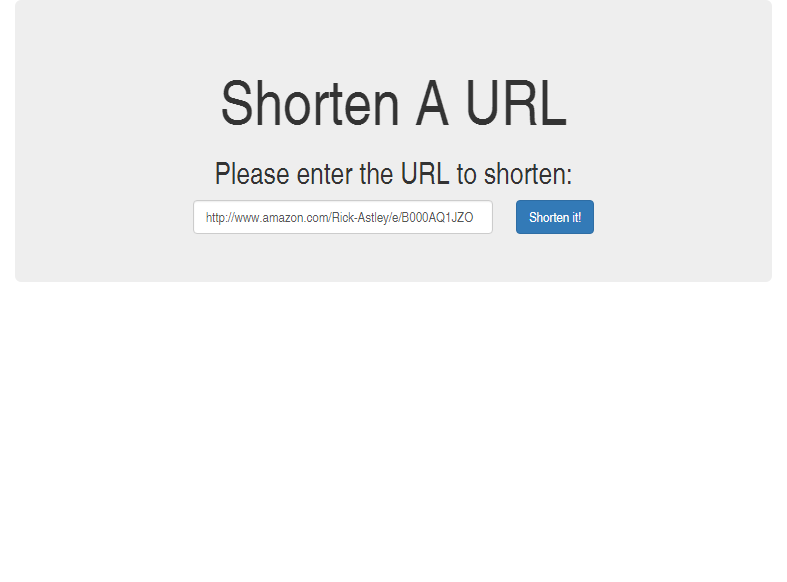

# LinkShorten

This is my first time writing  [Go](//github.com/golang). I thought it would be fun to write a URL shortener to get a feel for the language.

This was also my first time interacting with SQLite, which I chose as the database for this project.

## To-Do List
These are some relatively short-term changes that I would like to implement

- [x] Keep a hit counter per link of how many times the short version has been accessed
- [x] Use `html/template` instead of the janky string replacement.
- [ ] Move the logic that turns `ints` into `strings` and vice-versa to another source code file or even another package.
- [x] Figure out how to do *relative* redirects with query parameters.
- [x] Take parameters from the command line, especially port number.

## Future Work
There are a few things I would like to improve about this project.

1. Figure out if it is possible to shuffle data around between views. It is good practice to redirect after a POST request, so the browser never asks the user [this](http://i.stack.imgur.com/oNALr.png). In another project with using the Laravel web framework, it was really easy to include data in a redirect. I haven't been able to do this in Go, so the parameter had to be sent in the URL.
2. Test with MariaDB, and prove to myself that `database/sql` abstracts away the underlying database.
3. Investigate something like `mod_go` for nginx instead of nginx proxying the Go http server.
4. Should the API return an error boolean? Presently, the user could check the HTTP response code (Non-200 meaning an error occured)

## Screenshot
